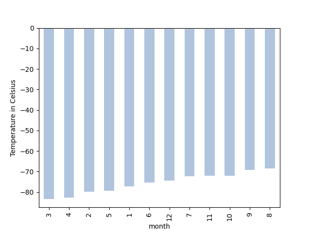
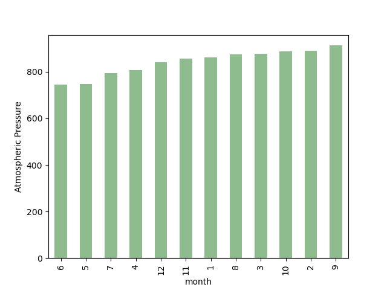
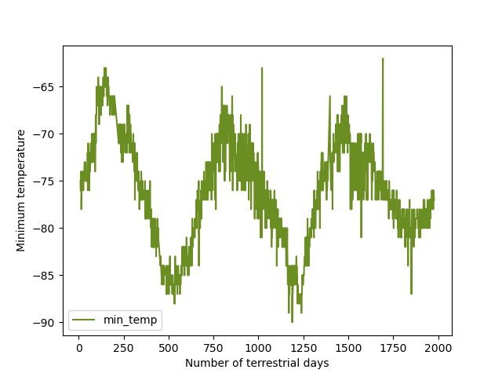

# web-scrape-challenge
## Part 1: Scrape Titles and Preview Text from Mars News
* Automated browsing (with Splinter) was used to visit the Mars news site, and the HTML code was extracted (with Beautiful Soup).
  - Visit site using URL
  - Scrape site using a Beautiful Soup object
* The titles and preview text of the news articles were scraped and extracted.
  - Store results in a Python dictionary
  - Store dictionaries in Python list
* The scraped information was stored in the specified Python data structure—specifically, a list of dictionaries.
  - Print list in notebook to check

## Part 2: Scrape and Analyze Mars Weather Data
* The HTML table was extracted into a Pandas DataFrame. Either Pandas or Splinter and Beautiful Soup were used to scrape the data. The columns have the correct headings and data types.
* The data was analyzed to answer the following questions:
   - How many months exist on Mars?
     ```
     mars_df['month'].value_counts().sort_index()
     ```
   - How many Martian days' worth of data are there?
     ```
     mars_df['sol'].count()
     ```
* The data was analyzed to answer the following questions, and a data visualization was created to support each answer:
   - Which month, on average, has the lowest temperature? The highest?
     
   - Which month, on average, has the lowest atmospheric pressure? The highest?
     
   - How many terrestrial days exist in a Martian year? A visual estimate within 25% was made.
     
* The DataFrame was exported into a CSV file. 
  ```
  mars_df.to_csv('Resources/mars_data.csv')
  ```
  
## Files 
* part_1_mars_news.ipynb
* part_2_mars_weather.ipynb
* Resources
  - avg_pressure.png
  - avg_temp.png
  - cold_to_hot_temps.png
  - earth_days.png
  - mars_data.csv

## Resources
* [pandas.DateFrame.astype](https://pandas.pydata.org/docs/reference/api/pandas.DataFrame.astype.html)
* [Pandas: How to Sort Results of value_counts\( \)](https://www.statology.org/pandas-value_counts-sort/)
* [List of named colors](https://matplotlib.org/stable/gallery/color/named_colors.html)
